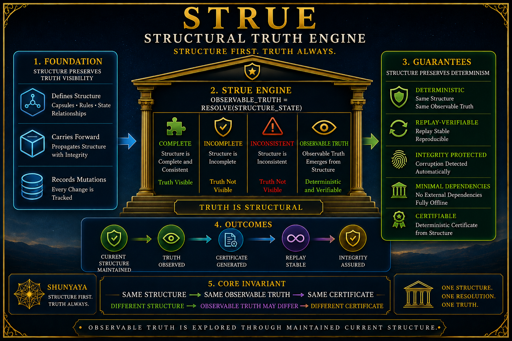

# ⭐ **STRUE**

## **Structural Truth Engine**

### **Query-time property retrieval through maintained current structure rather than repeated traversal-based rediscovery**


---

**Why recursively rediscover folder truth when structure may already preserve it?**

STRUE explores whether query-time property retrieval fundamentally requires traversal when maintained current structure already preserves truth.

Representative benchmark observations from the reference environment:

- **1,000 files** → approximately `~3 us` structural lookup vs `~1,300 ms` traversal
- **10,000 files** → approximately `~4 us` structural lookup vs `~13,000 ms` traversal
- **50,000 files** → approximately `~5 us` structural lookup vs `~50,000 ms` traversal

Same structure.

Same truth.

Same certificates.

Query-time property retrieval occurs from maintained current structure rather than repeated recursive rediscovery.

These measurements are descriptive observations from the STRUE reference environment.

They are intended to be reproducible demonstrations — not universal guarantees.

The question STRUE explores is therefore not:

`can traversal disappear?`

The question is:

`does query_time_property_retrieval fundamentally require traversal when structure already preserves truth?`

---

Traditional systems often assume:

`folder -> traversal -> properties -> truth`

STRUE explores:

`maintained_current_structure -> observable_truth -> query_time_property_retrieval`

Core invariant:

`truth_visible iff structure_updated`

---

# 🔍 **Positioning & Scope**

STRUE is a structural truth and observability demonstration framework — not a filesystem replacement.

It explores whether query-time property retrieval fundamentally requires traversal when maintained current structure already preserves truth.

STRUE does **not** replace:

- filesystems
- storage systems
- databases
- object stores
- existing infrastructure

Instead, STRUE explores a narrower question:

**Can truth remain structurally visible before traversal-based rediscovery begins?**

The demonstrations are intentionally designed to be:

- deterministic
- replayable
- inspectable
- falsifiable

STRUE complements existing infrastructure.

It is not intended to replace it.

---

# 📊 **Benchmark Summary (Reference Environment)**

Measured using `STRUE_v1_2.py benchmark`.

These measurements compare:

`maintained current structure -> property retrieval`

versus:

`recursive traversal -> property reconstruction`

| Files | Structural Lookup | Traversal | Speedup (preloaded lookup vs traversal) |
|------:|:----------------:|:---------:|:---------------------------------------:|
| 1,000 | ~3 us | ~1,300 ms | ~400,000x |
| 10,000 | ~4 us | ~13,000 ms | ~3,000,000x |
| 50,000 | ~5 us | ~50,000 ms | ~10,000,000x |

**Observed behavior:**

- structural lookup remains approximately flat across tested scales
- traversal cost increases with object count
- identical structure produces identical observable truth
- retrieval occurs from maintained current structure rather than repeated rediscovery
- benchmark behavior remained consistent across repeated runs
- end-to-end query time (index load + lookup) is reported separately in benchmark output and reflects a different cost model from preloaded lookup alone

These measurements are descriptive observations from the reference environment.

They are reproducible demonstrations.

They are not universal guarantees.

Raw benchmark outputs are available in `VERIFY/benchmark_raw_results.txt`.

All results are reproducible using the commands above with Python 3.9+ and no external dependencies.

---

## **Reproduce These Measurements**

```
python demo/STRUE_v1_2.py demo --root STRUE_DEMO --files 1000 --clean

python demo/STRUE_v1_2.py benchmark --root STRUE_DEMO --path Project
```

---

# ⚡ **90-Second Structural Proof**

Open:

```
python demo/STRUE_v1_2.py demo --root STRUE_DEMO --files 1000 --clean
```

Check state:

```
python demo/STRUE_v1_2.py status --root STRUE_DEMO
```

Benchmark:

```
python demo/STRUE_v1_2.py benchmark --root STRUE_DEMO --path Project
```

Expected:

- query-time retrieval through maintained current structure
- deterministic truth certificates
- replay-safe observability
- structural verification
- corruption detection
- structural recovery

---

# 🚀 **Quick Start**

```
python demo/STRUE_v1_2.py demo --root STRUE_DEMO --files 1000 --clean
```

Create Mutations:

```
python demo/STRUE_v1_2.py batch --root STRUE_DEMO --count 100
```

Verify:

```
python demo/STRUE_v1_2.py verify --root STRUE_DEMO
```

Benchmark:

```
python demo/STRUE_v1_2.py benchmark --root STRUE_DEMO --path Project
```

Open Local Server:

```
python -m http.server 8000 --directory demo
```

Open Observatory:

```
http://localhost:8000/STRUE-Explorer-v1_2.html
```

Browser Console:

```
STRUE.smoke()
```

---

# 🌐 **Interactive Structural Observatory**

STRUE includes an offline interactive observatory for visualizing structural truth.

The browser console acts as an interactive structural observatory and validation surface.

Open the observatory in your browser using the local server URL.

The observatory demonstrates:

- structural folder properties
- query-time property retrieval
- mutation propagation
- corruption injection
- recovery validation
- replay verification
- benchmark visualization

Browser Console:

```
STRUE.smoke()
```

Example:

```
STRUE.show()

STRUE.batch(100)

STRUE.verify()

STRUE.corrupt()

STRUE.recover()

STRUE.civilization()
```

Expected:

- `PASS`
- deterministic replay
- corruption detection
- structural recovery
- structure-driven observability

---

# 🧩 **Core Structural Model**

Traditional:

`folder_truth -> traversal -> properties`

STRUE:

`maintained_current_structure -> observable_truth -> query_time_property_retrieval`

Query-time retrieval explores:

`retrieval_cost proportional_to mutation_set`

rather than:

`retrieval_cost proportional_to object_count`

within maintained current structure.

---

# 🔬 **How STRUE Differs from Existing Approaches**

| Approach | How properties are retrieved | STRUE difference |
|---|---|---|
| `os.walk` / `du` | Recursive traversal computes properties during retrieval | STRUE reads maintained capsules instead |
| `inotify` / FSEvents | Event systems detect changes but aggregate retrieval may still require additional computation | STRUE propagates structural aggregates during mutation |
| Git tree-SHA model | Content-addressed trees preserve content identity rather than property aggregates | STRUE maintains `size`, `file_count`, and `dir_count` structurally |
| Database metadata tables | Often requires external infrastructure and metadata services | STRUE uses stdlib JSON with no external dependencies |

The core distinction:

Traditional approaches often reconstruct properties during retrieval.

STRUE explores:

`mutation -> propagation -> maintained structure -> retrieval`

rather than:

`retrieval -> traversal -> reconstruction`

Property retrieval therefore occurs through maintained current structure rather than repeated recursive rediscovery during retrieval.

Lookup cost is explored through structural access rather than object-count-scaled rediscovery.

---

# ⚡ **Structural Capsules**

Each folder maintains structural truth through capsules.

Capsules store:

- size
- file count
- directory count
- mutation id
- structural certificates
- truth certificates

Properties become:

`read capsule`

instead of repeatedly requiring:

`recursive traversal`

during query-time retrieval

---

# 🧩 **Structural Vocabulary**

| Symbol | Meaning |
|---|---|
| `capsule` | bounded structural truth container |
| `truth_certificate` | deterministic truth fingerprint |
| `root_certificate` | structural capsule identity |
| `history_certificate` | mutation history identity |
| `mutation_set` | changed structural region |
| `RESOLVED` | truth structurally visible |
| `verify()` | structural truth validation |
| `recover()` | structural truth restoration |
| `replay()` | deterministic truth reconstruction |

---

# 🔁 **Deterministic Invariant**

`same structure -> same truth`

`same structure -> same certificates`

`same structure -> same observability`

---

# 🔐 **Verification & Recovery**

STRUE includes:

- deterministic replay
- certificate auditing
- corruption detection
- truth recovery
- release validation

Inject corruption:

```
python demo/STRUE_v1_2.py corrupt ^
--root STRUE_DEMO ^
--path Project ^
--mode size ^
--delta 9
```

Recover:

```
python demo/STRUE_v1_2.py recover --root STRUE_DEMO
```

---

# 🧪 **Reference Validation**

Smoke Test:

```
python demo/STRUE_v1_2.py demo --root STRUE_DEMO --files 1000 --clean

python demo/STRUE_v1_2.py batch --root STRUE_DEMO --count 100

python demo/STRUE_v1_2.py benchmark --root STRUE_DEMO --path Project

python demo/STRUE_v1_2.py verify --root STRUE_DEMO
```

Expected:

- `status=PASS`
- `structure_current=true`
- `truth_visible=true`
- `certificate_integrity=true`

---

# 🧭 **Architecture**



STRUE explores structural truth as a layer between:

storage

↓

structure

↓

truth

↓

observability

The focus is not traversal elimination.

The focus is structural truth visibility.

---

# 🌍 **Domain Impact Directions**

STRUE explores a broader question:

**Can truth remain visible without repeatedly rediscovering truth?**

The invariant:

`truth_visible iff structure_updated`

may apply wherever properties are aggregated over hierarchical structures.

One concrete direction:

**Build systems and CI artifact caches**

Many systems periodically compute:

- cache sizes
- artifact counts
- storage consumption
- dependency statistics

These operations often rely upon repeated enumeration or traversal.

A STRUE-style capsule layer instead explores:

`mutation -> propagation -> maintained structure -> retrieval`

Properties become structurally maintained during mutation and retrieved from maintained current structure.

This shifts the question from:

`when should we re-scan?`

toward:

`how should structural truth propagate?`

Important open questions remain:

- concurrent writers
- distributed propagation
- partial synchronization
- failure recovery
- large-scale structural consistency

Other possible directions:

- cloud object metadata aggregation
- observability dashboards
- package registry indexes
- artifact repositories
- hierarchical metric systems
- storage accounting systems

The invariant remains:

`truth_visible iff structure_updated`

---

# ⚠️ **Scope & Boundaries**

STRUE is a bounded reference demonstration.

It does **not** claim:

- filesystem replacement
- storage replacement
- universal speed superiority
- production infrastructure certification
- universal traversal elimination

**What STRUE demonstrates within the reference model using stdlib Python and fully offline execution:**

- query-time property retrieval may not fundamentally require traversal when maintained current structure already preserves truth
- corruption becomes structurally observable
- recovery reconstructs observable truth from preserved structure
- identical structure produces identical truth and certificates across runs
- structural observability remains replayable and inspectable

Traversal still exists within STRUE.

Traversal remains part of:

- initialization
- synchronization
- verification
- recovery
- release validation

The narrower claim explored by STRUE is:

`maintained_current_structure -> observable_truth -> query_time_property_retrieval`

rather than:

`retrieval -> traversal -> reconstruction`

---

# 🖥️ **Observatory Quickstart (Platform-Specific)**

The STRUE observatory runs fully offline and acts as an interactive structural observability surface.

**Windows**

```
python demo/STRUE_v1_2.py demo --root STRUE_DEMO --files 1000 --clean

python -m http.server 8000 --directory demo
```

Open:

`http://localhost:8000/STRUE-Explorer-v1_2.html`

---

**macOS / Linux**

```
python3 demo/STRUE_v1_2.py demo --root STRUE_DEMO --files 1000 --clean

python3 -m http.server 8000 --directory demo
```

Open:

`http://localhost:8000/STRUE-Explorer-v1_2.html`

---

Then use the browser console:

```
STRUE.smoke()

STRUE.corrupt()

STRUE.verify()

STRUE.recover()
```

Functions:

- `STRUE.smoke()` → structural validation suite
- `STRUE.corrupt()` → inject corruption
- `STRUE.verify()` → observe detection
- `STRUE.recover()` → restore structural truth

Modern browsers restrict direct `file://` execution.

The local server step is therefore required.

---

# 📂 **Documentation**

- [Quickstart](docs/Quickstart.md)
- [FAQ](docs/FAQ.md)
- [Proof Sketch](docs/Proof-Sketch.md)
- [STRUE Architecture Notes](docs/STRUE-Architecture-Notes.md)
- [STRUE Challenge](docs/STRUE-Challenge.md)
- [STRUE Architecture Diagram](docs/STRUE-Diagram.png)

### **Verification & Benchmark Artifacts**

- [STRUE Verification](VERIFY/VERIFY.txt)
- [Freeze Hashes](VERIFY/FREEZE_DEMO_SHA256.txt)
- [Benchmark Summary](VERIFY/benchmark_summary.txt)
- [Benchmark Raw Results](VERIFY/benchmark_raw_results.txt)

### **Ecosystem Context**

These diagrams provide broader structural context surrounding STRUE.

They represent ecosystem context — **not additional STRUE guarantees.**

- [Dependency Elimination Framework](docs/Dependency-Elimination-Framework.png)
- [Shunyaya Structural Stack](docs/Shunyaya-Structural-Stack.png)

---

# 🧭 Verification Commands

Verify:

```
python demo/STRUE_v1_2.py verify --root STRUE_DEMO
```

Status:

```
python demo/STRUE_v1_2.py status --root STRUE_DEMO
```

Release Validation:

```
python demo/STRUE_v1_2.py civilization --root STRUE_DEMO
```

---

# 🔥 **Break STRUE**

Attempt:

- same structure -> different truth
- replay -> different certificates
- corruption -> invisible to verification
- recovery -> incorrect truth restoration
- structural properties requiring traversal

Invariant under test:

`same structure -> same truth`

---

# 📜 **License**

See: [LICENSE](LICENSE)

### **Reference Implementation (This Repository):**

These STRUE reference implementation artifacts are released under the **Open Standard Reference License** —

free to use, study, implement, extend, validate, and deploy.

---

### **Architecture and Documentation:**

Licensed under CC BY-NC 4.0

---

# 🧭 **Roadmap**

Near-term:

- larger stress demonstrations (`100K+` object demonstrations)
- `benchmark_summary.txt` in `VERIFY/` containing reference measurements
- `COMPARE.md` — structural comparison with traversal, event systems, and content-addressed approaches
- `OBSERVATORY.md` — standalone observatory setup and validation guide
- stronger verification systems
- concurrency and structural propagation experiments

Long-term:

- database demonstrations
- object storage demonstrations
- distributed observability demonstrations
- broader structural truth ecosystems

STRUE evolves through:

demonstration

↓

verification

↓

observability

↓

structural truth

---

# 🌌 **Final Insight**

Traversal may reveal truth.

STRUE explores whether observable truth may remain structurally visible from maintained current structure before traversal-based rediscovery during retrieval begins.

**This is structural truth exploration.**

**This is STRUE.**
